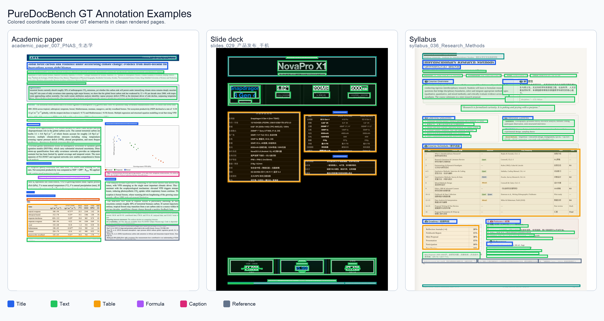

# PureDocBench

<p align="center">
  <strong>How far is document parsing from solved?</strong><br>
  A source-traceable benchmark for OCR and document parsing across clean, digitally degraded, and real-degraded document settings.
</p>

<p align="center">
  <a href="https://huggingface.co/datasets/zhihengli-casia/puredocbench"></a>
  <a href="LICENSE_DATA"></a>
  <a href="LICENSE"></a>
  <a href="paper/PureDocBench-paper.pdf"></a>
</p>

<p align="center">
  <a href="docs/README_ZH.md">中文说明</a> |
  <a href="https://huggingface.co/datasets/zhihengli-casia/puredocbench">Dataset</a> |
  <a href="paper/PureDocBench-paper.pdf">Paper</a> |
  <a href="docs/ANNOTATION_CORRECTIONS.md">GT Review & Corrections</a>
</p>

PureDocBench uses HTML/CSS document sources as hidden anchors: each page is rendered into images and annotated from the same structured source. This gives a benchmark where text, tables, formulas, captions, and reading order can be scored with less post-hoc annotation noise.

PureDocBench 是一个源可追踪的 OCR / 文档解析 benchmark。数据由 HTML/CSS 源文件渲染而来，GT 标注从同源结构中抽取，覆盖 clean、digital-degraded、real-degraded 三条图像轨道。

## Updates

- **2026-06-14**: Updated GT annotations and opened a [GT Review app](docs/ANNOTATION_CORRECTIONS.md) for community corrections. Release ID: `puredocbench-2026-06-14`.
- **2026-05-08**: Initial public release of PureDocBench, including the paper PDF and full dataset on [Hugging Face](https://huggingface.co/datasets/zhihengli-casia/puredocbench). Release ID: `puredocbench-2026-05-08`.

## GT Annotation Examples

The examples below show colored coordinate boxes over clean rendered pages from an academic paper, a slide deck, and a syllabus.

<p align="center">
  
</p>

<p align="center">
  
</p>

## At A Glance

| Item | Count |
|---|---:|
| Official pages | 1,475 |
| Official images | 4,425 |
| Top-level domains | 10 |
| Fine-grained subcategories | 66 |
| Image tracks | clean, digital-degraded, real-degraded |
| Scored structures | text, formulas, tables, reading order |

## Main Leaderboard

The paper evaluates 40 systems across pipeline specialists, end-to-end document parsers, and general-purpose VLMs. Table 2 is the main leaderboard: each track reports Overall, TextEdit, FormulaCDM, TableTEDS, and ROEdit; Avg3 averages the three track Overall scores.

<p align="center">
  
</p>

## Diagnostics

The diagnostic panel shows where current systems still have headroom. Formula recognition is the largest single bottleneck, and real degradation changes rankings more sharply than digital degradation.

<p align="center">
  
</p>

## Case Studies

The four case studies below are all taken from the paper. They show failures that aggregate scores can hide: notation loss, reading-order mistakes, annotation contamination, table-structure errors, character-level corruption, and missing visual authentication cues.

### Case 1: Academic

<p align="center">
  
</p>

### Case 2: Business

<p align="center">
  
</p>

### Case 3: Finance

<p align="center">
  
</p>

### Case 4: Certificate

<p align="center">
  
</p>

## Appendix Highlights

The appendix documents the degradation design, per-category behavior, and source-validity checks used to make the benchmark reproducible.

<p align="center">
  
</p>

<p align="center">
  
</p>

<p align="center">
  
</p>

<p align="center">
  
</p>

## Download

The full image/GT/HTML release is hosted on Hugging Face:

```bash
# After downloading all files from Hugging Face:
shasum -a 256 -c SHA256SUMS.txt
cat pdb_full.tar.part-* | tar -xf -
```

Verify the split archive and reconstructed release:

```bash
python scripts/verify_split_archive.py /path/to/downloaded/files

python scripts/validate_release_manifest.py \
  --release-root /path/to/puredocbench-2026-06-14 \
  --manifest manifests/release_manifest_candidate_1475.csv
```

## GT Review

Current release ID: `puredocbench-2026-06-14`.
Use the review app to inspect annotations and export correction patches.

- Public review app:
  [Open GT Review App](https://zhihengli-casia.github.io/PureDocBench/review/gt_case_compare_all_fixed7/index.html?cb=puredocbench_2026_06_14_clean_ui)
- Repository file:
  [`review/gt_case_compare_all_fixed7/index.html`](review/gt_case_compare_all_fixed7/index.html)
- Correction guide:
  [docs/ANNOTATION_CORRECTIONS.md](docs/ANNOTATION_CORRECTIONS.md)
- Submit a correction:
  [New GT annotation correction issue](https://github.com/zhihengli-casia/PureDocBench/issues/new?template=annotation_error.yml) (English or Chinese)

Local launch:

```bash
mkdir -p review/gt_case_compare_all_fixed7/assets
ln -s /path/to/puredocbench-2026-06-14/images/clean review/gt_case_compare_all_fixed7/assets/images
python3 -m http.server 8767 --directory review/gt_case_compare_all_fixed7
```

Open:

```text
http://127.0.0.1:8767/index.html?cb=puredocbench_2026_06_14_clean_ui
```

Static app URL:

```text
https://zhihengli-casia.github.io/PureDocBench/review/gt_case_compare_all_fixed7/index.html?cb=puredocbench_2026_06_14_clean_ui
```

The GitHub repository does not include the full image release. For visual
review on GitHub Pages, click `Load Images` and select the downloaded
`images/clean` folder. Local launch can also use the symlink above.

## GT Coordinates

If you need spatial labels, regenerate clean-render coordinates from the
HTML/CSS sources:

```bash
python scripts/add_gt_coordinates.py \
  --release-root /path/to/puredocbench-2026-06-14 \
  --manifest manifests/release_manifest_candidate_1475.csv \
  --in-place \
  --include-bbox \
  --include-coordinate-system \
  --report coordinate_report.json

python scripts/validate_release_manifest.py \
  --release-root /path/to/puredocbench-2026-06-14 \
  --manifest manifests/release_manifest_candidate_1475.csv \
  --require-coordinates \
  --require-bbox
```

The script follows the OmniDocBench GT convention and adds a rectangular `poly`
field to each `layout_dets` item. `poly` is a flat list of clean-image pixel
coordinates in top-left, top-right, bottom-right, bottom-left order:
`[x1, y1, x2, y1, x2, y2, x1, y2]`. A derived `bbox: [x1, y1, x2, y2]` can also
be written with `--include-bbox`, but `poly` is the primary coordinate field.
Run `playwright install chromium` first if the Playwright browser is not
installed, or pass `--browser-channel chrome` to use a local Chrome
installation.

## Inference And Scoring

PureDocBench includes a public CLI for model-agnostic inference, lightweight scoring, and OmniDocBench export:

```bash
pip install -e .

puredocbench infer \
  --images /path/to/puredocbench-2026-06-14/images/clean \
  --output-dir predictions/my_model_clean \
  --command-template 'python my_model_infer.py --image {image} --out {output}'

puredocbench score \
  --release-root /path/to/puredocbench-2026-06-14 \
  --manifest manifests/release_manifest_candidate_1475.csv \
  --pred-dir predictions/my_model_clean \
  --track clean \
  --out-dir scores/my_model_clean
```

See [docs/INFERENCE_SCORING.md](docs/INFERENCE_SCORING.md) for the full interface and OmniDocBench export path.

## Repository Contents

```text
manifests/                         Release and sample manifests
metadata/                          Dataset card and Croissant metadata
scripts/                           Rendering, degradation, validation, leaderboard tools
puredocbench/                      Public inference, scoring, and OmniDocBench export CLI
model_inference/                   Sanitized model inference configs and runners
supplemental_inference_scoring/    API/local inference and scoring utilities
assets/figures/                    Figures from the paper
paper/                             Paper PDF
```

## Quick Start

```bash
python -m venv .venv
source .venv/bin/activate
pip install -r requirements.txt
playwright install chromium
```

Render one HTML page:

```bash
python scripts/render_single_image.py \
  --html /path/to/page.html \
  --out /path/to/page.png \
  --dpi 300
```

Apply a deterministic degradation profile:

```bash
python scripts/apply_degradation_ablation.py \
  --input /path/to/clean_images \
  --output /path/to/degraded_images \
  --profile full_medium
```

## License

- Dataset assets are released under **CC BY 4.0**; see [LICENSE_DATA](LICENSE_DATA).
- Code in this repository is released under the license in [LICENSE](LICENSE).
- Model weights are not redistributed.

## Citation

```bibtex
@misc{puredocbench,
  title        = {How Far Is Document Parsing from Solved? PureDocBench: A Source-Traceable Benchmark across Clean, Degraded, and Real-World Settings},
  author       = {Li, Zhiheng and collaborators},
  year         = {2026},
  howpublished = {\url{https://github.com/zhihengli-casia/puredocbench}},
  note         = {Dataset and benchmark release}
}
```
