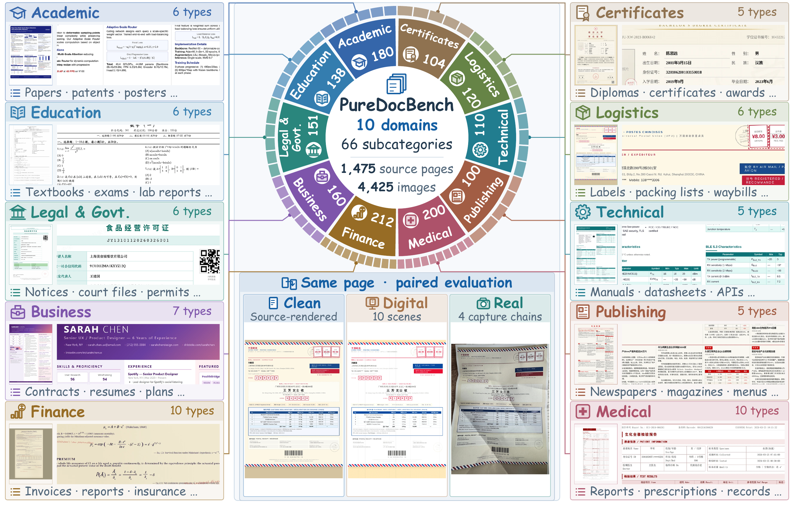
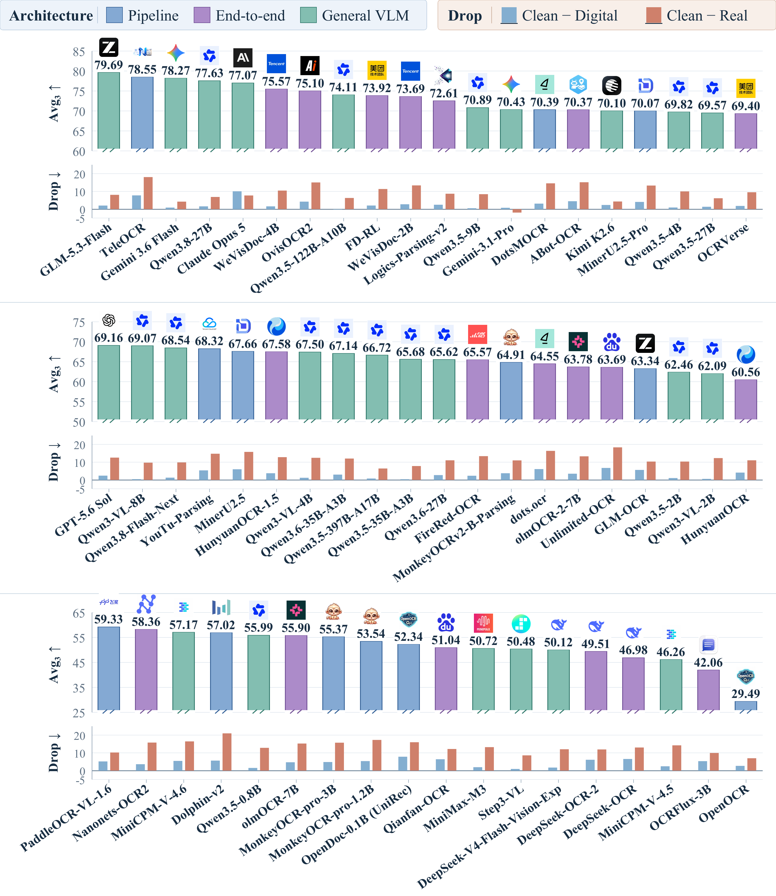
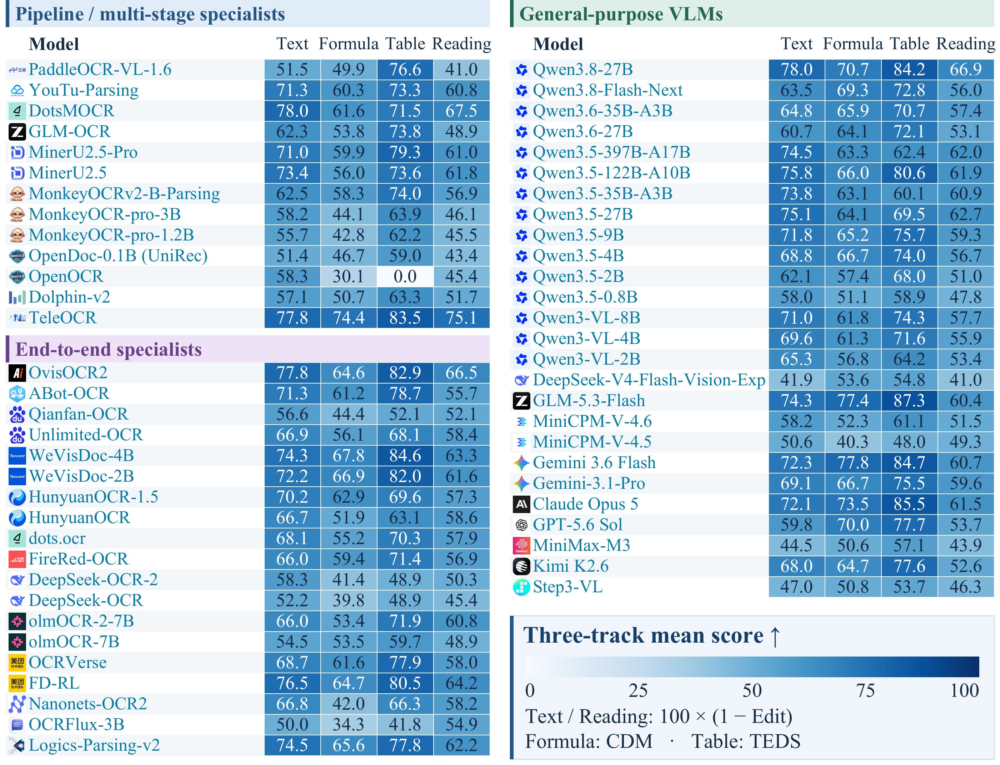
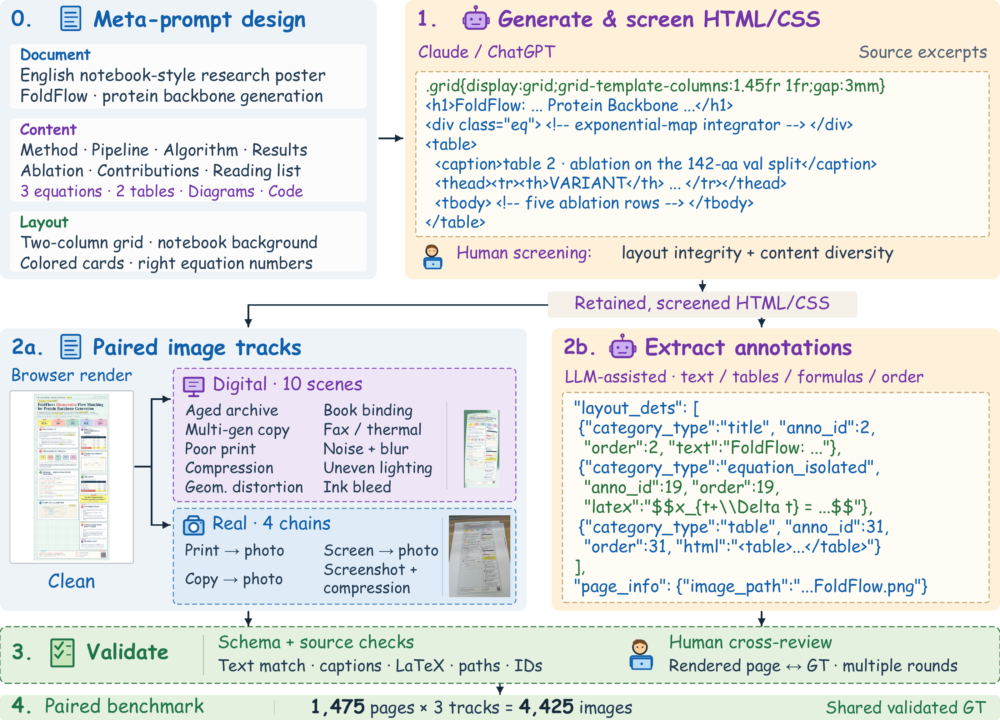
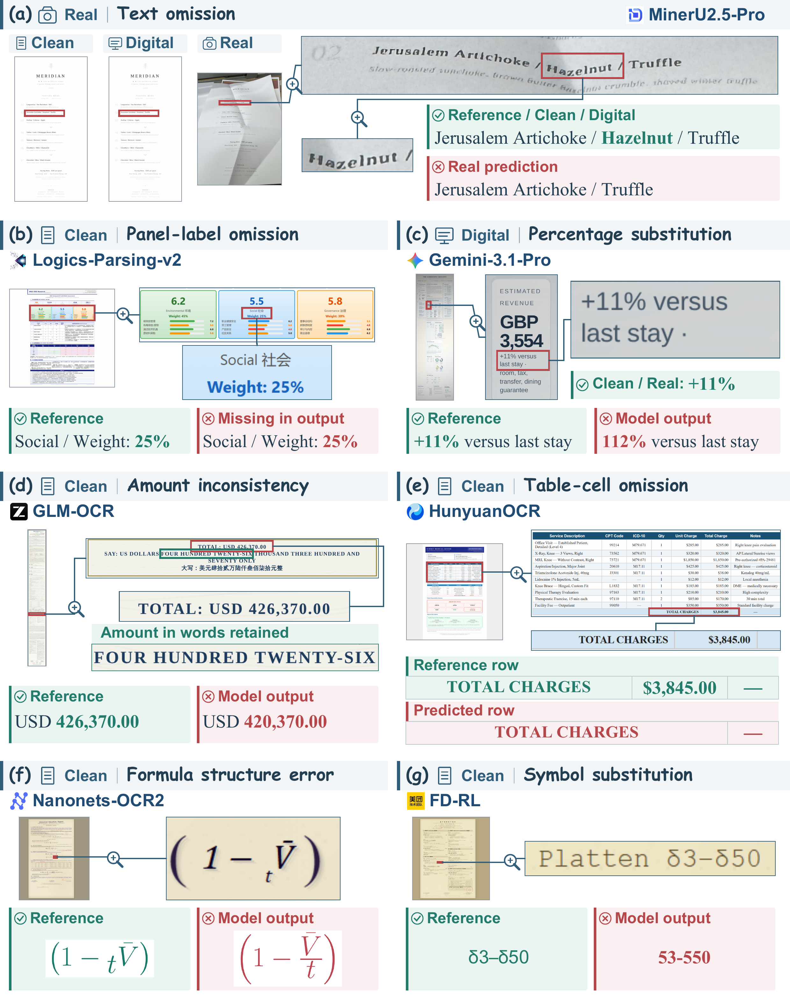
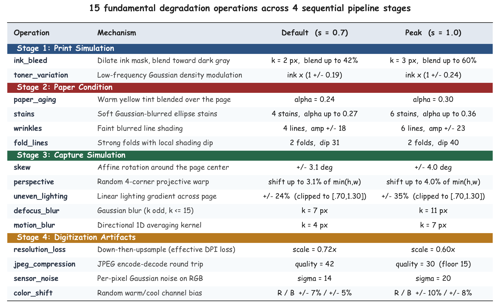
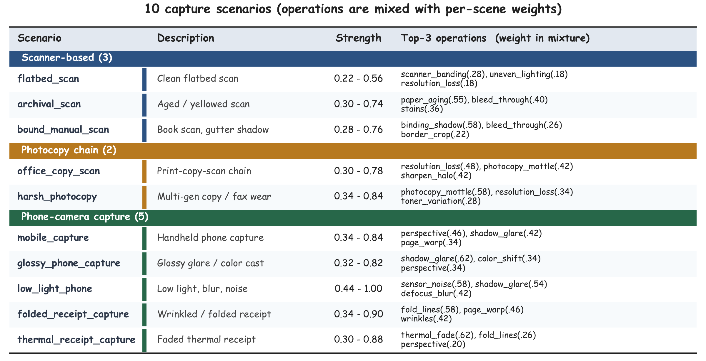
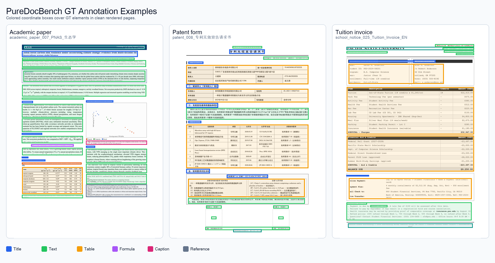

# PureDocBench

<p align="center">
  <strong>A source-traceable benchmark for document parsing</strong><br>
  1,475 pages · 10 domains · 66 subcategories · 4,425 matched Clean / Digital / Real images
</p>

<p align="center">
  <a href="https://huggingface.co/datasets/zhihengli-casia/puredocbench"></a>
  <a href="https://zhihengli-casia.github.io/PureDocBench/leaderboard.html"></a>
  <a href="LICENSE_DATA"></a>
  <a href="LICENSE"></a>
</p>

<p align="center">
  <a href="docs/README_ZH.md">中文说明</a> |
  <a href="https://huggingface.co/datasets/zhihengli-casia/puredocbench">Dataset</a> |
  <a href="#main-leaderboard">Results</a> |
  <a href="#data-construction">Paper figures</a> |
  <a href="docs/ANNOTATION_CORRECTIONS.md">GT Review & Corrections</a>
</p>

PureDocBench evaluates text, formulas, tables, and reading order across matched document images. Each page is created from an HTML/CSS source, which also provides its structured annotations. Clean, Digital, and Real inputs share the same content and references, enabling comparisons across image conditions.

<p align="center">
  <a href="assets/figures/teaser.png"></a>
</p>

## Updates

- **2026-09-26**: Updated the current benchmark results to **58 models**, with all four component metrics and per-domain results for 53 models. Refreshed the overview, construction, model comparison, component, and seven-case figures. [Results files](results/) · [Interactive leaderboard](https://zhihengli-casia.github.io/PureDocBench/leaderboard.html).
- **2026-09-21**: Added the authors' WeVisDoc submissions, retained in the [community result archive](data/README.md).
- **Current GT**: The stable alias is `puredocbench-gt-latest`; its exact revision is recorded in [Hugging Face `gt/latest.json`](https://huggingface.co/datasets/zhihengli-casia/puredocbench/blob/main/gt/latest.json).

## Main Leaderboard

The current evaluation covers **13 pipeline / multi-stage specialists, 19 end-to-end specialists, and 26 general-purpose VLMs**, including recent releases through September 2026. The table reports Overall on each track and their mean, Avg₃. Model names link to official resources; release months follow each name. **Bold** marks the best result in each column.

<p align="center">
  <a href="https://zhihengli-casia.github.io/PureDocBench/leaderboard.html"><strong>Open the interactive leaderboard: search, filter, and sort all component metrics ↗</strong></a>
</p>

<table>
  <thead><tr><th align="left">Model (release)</th><th align="right">Clean ↑</th><th align="right">Digital ↑</th><th align="right">Real ↑</th><th align="right">Avg<sub>3</sub> ↑</th></tr></thead>
  <tbody>
    <tr><th colspan="5" align="left">Pipeline / multi-stage specialists (13)</th></tr>
    <tr><td><a href="https://huggingface.co/PaddlePaddle/PaddleOCR-VL-1.6">PaddleOCR-VL-1.6</a> (2026-05)</td><td align="right">64.46</td><td align="right">59.29</td><td align="right">54.24</td><td align="right">59.33</td></tr>
    <tr><td><a href="https://huggingface.co/tencent/Youtu-Parsing">YouTu-Parsing</a> (2026-01)</td><td align="right">75.02</td><td align="right">69.66</td><td align="right">60.29</td><td align="right">68.32</td></tr>
    <tr><td><a href="https://huggingface.co/dots-studio/dots.mocr">DotsMOCR</a> (2026-03)</td><td align="right">76.27</td><td align="right">73.16</td><td align="right">61.73</td><td align="right">70.39</td></tr>
    <tr><td><a href="https://huggingface.co/zai-org/GLM-OCR">GLM-OCR</a> (2026-02)</td><td align="right">68.65</td><td align="right">63.06</td><td align="right">58.31</td><td align="right">63.34</td></tr>
    <tr><td><a href="https://huggingface.co/opendatalab/MinerU2.5-Pro-2604-1.2B">MinerU2.5-Pro</a> (2026-04)</td><td align="right">75.87</td><td align="right">71.77</td><td align="right">62.56</td><td align="right">70.07</td></tr>
    <tr><td><a href="https://huggingface.co/opendatalab/MinerU2.5-2509-1.2B">MinerU2.5</a> (2025-09)</td><td align="right">74.90</td><td align="right">68.92</td><td align="right">59.15</td><td align="right">67.66</td></tr>
    <tr><td><a href="https://huggingface.co/zenosai/MonkeyOCRv2-B-Parsing">MonkeyOCRv2-B-Parsing</a> (2026-07)</td><td align="right">69.82</td><td align="right">66.08</td><td align="right">58.83</td><td align="right">64.91</td></tr>
    <tr><td><a href="https://huggingface.co/echo840/MonkeyOCR-pro-3B">MonkeyOCR-pro-3B</a> (2025-08)</td><td align="right">62.23</td><td align="right">57.40</td><td align="right">46.49</td><td align="right">55.37</td></tr>
    <tr><td><a href="https://huggingface.co/echo840/MonkeyOCR-pro-1.2B">MonkeyOCR-pro-1.2B</a> (2025-07)</td><td align="right">61.09</td><td align="right">55.72</td><td align="right">43.82</td><td align="right">53.54</td></tr>
    <tr><td><a href="https://github.com/Topdu/OpenOCR/blob/main/docs/opendoc.md">OpenDoc-0.1B (UniRec)</a> (2025-12)</td><td align="right">60.28</td><td align="right">52.46</td><td align="right">44.27</td><td align="right">52.34</td></tr>
    <tr><td><a href="https://huggingface.co/topdu/OpenOCR">OpenOCR</a> (2024-11)</td><td align="right">32.70</td><td align="right">30.03</td><td align="right">25.73</td><td align="right">29.49</td></tr>
    <tr><td><a href="https://huggingface.co/ByteDance/Dolphin-v2">Dolphin-v2</a> (2025-12)</td><td align="right">65.90</td><td align="right">60.24</td><td align="right">44.92</td><td align="right">57.02</td></tr>
    <tr><td><a href="https://huggingface.co/StarDoc-AI/TeleOCR">TeleOCR</a> (2026-08)</td><td align="right"><strong>87.16</strong></td><td align="right">79.40</td><td align="right">69.08</td><td align="right">78.55</td></tr>
    <tr><th colspan="5" align="left">End-to-end specialists (19)</th></tr>
    <tr><td><a href="https://huggingface.co/ATH-MaaS/OvisOCR2">OvisOCR2</a> (2026-07)</td><td align="right">81.53</td><td align="right">77.29</td><td align="right">66.49</td><td align="right">75.10</td></tr>
    <tr><td><a href="https://huggingface.co/acvlab/ABot-OCR">ABot-OCR</a> (2026-05)</td><td align="right">76.92</td><td align="right">72.43</td><td align="right">61.77</td><td align="right">70.37</td></tr>
    <tr><td><a href="https://huggingface.co/baidu/Qianfan-OCR">Qianfan-OCR</a> (2026-03)</td><td align="right">57.22</td><td align="right">50.85</td><td align="right">45.06</td><td align="right">51.04</td></tr>
    <tr><td><a href="https://huggingface.co/baidu/Unlimited-OCR">Unlimited-OCR</a> (2026-06)</td><td align="right">72.05</td><td align="right">65.30</td><td align="right">53.71</td><td align="right">63.69</td></tr>
    <tr><td><a href="https://huggingface.co/tencent/WeVisDoc-4B">WeVisDoc-4B</a> (2026-09)</td><td align="right">79.59</td><td align="right">77.99</td><td align="right">69.14</td><td align="right">75.57</td></tr>
    <tr><td><a href="https://huggingface.co/tencent/WeVisDoc-2B">WeVisDoc-2B</a> (2026-09)</td><td align="right">79.08</td><td align="right">76.33</td><td align="right">65.68</td><td align="right">73.69</td></tr>
    <tr><td><a href="https://huggingface.co/tencent/HunyuanOCR">HunyuanOCR-1.5</a> (2026-07)</td><td align="right">73.09</td><td align="right">69.36</td><td align="right">60.28</td><td align="right">67.58</td></tr>
    <tr><td><a href="https://huggingface.co/tencent/HunyuanOCR/tree/main/v1.0">HunyuanOCR</a> (2025-11)</td><td align="right">65.61</td><td align="right">61.49</td><td align="right">54.58</td><td align="right">60.56</td></tr>
    <tr><td><a href="https://huggingface.co/dots-studio/dots.ocr">dots.ocr</a> (2025-07)</td><td align="right">72.01</td><td align="right">65.95</td><td align="right">55.68</td><td align="right">64.55</td></tr>
    <tr><td><a href="https://huggingface.co/FireRedTeam/FireRed-OCR">FireRed-OCR</a> (2026-02)</td><td align="right">70.81</td><td align="right">68.49</td><td align="right">57.42</td><td align="right">65.57</td></tr>
    <tr><td><a href="https://huggingface.co/deepseek-ai/DeepSeek-OCR-2">DeepSeek-OCR-2</a> (2026-01)</td><td align="right">55.53</td><td align="right">49.41</td><td align="right">43.60</td><td align="right">49.51</td></tr>
    <tr><td><a href="https://huggingface.co/deepseek-ai/DeepSeek-OCR">DeepSeek-OCR</a> (2025-10)</td><td align="right">53.50</td><td align="right">46.95</td><td align="right">40.48</td><td align="right">46.98</td></tr>
    <tr><td><a href="https://huggingface.co/allenai/olmOCR-2-7B-1025">olmOCR-2-7B</a> (2025-10)</td><td align="right">69.36</td><td align="right">65.87</td><td align="right">56.10</td><td align="right">63.78</td></tr>
    <tr><td><a href="https://huggingface.co/allenai/olmOCR-7B-0825">olmOCR-7B</a> (2025-08)</td><td align="right">62.56</td><td align="right">57.84</td><td align="right">47.30</td><td align="right">55.90</td></tr>
    <tr><td><a href="https://huggingface.co/DocTron/OCRVerse">OCRVerse</a> (2026-01)</td><td align="right">73.18</td><td align="right">71.36</td><td align="right">63.66</td><td align="right">69.40</td></tr>
    <tr><td><a href="https://huggingface.co/DocTron/FD-RL">FD-RL</a> (2025-11)</td><td align="right">78.38</td><td align="right">76.33</td><td align="right">67.04</td><td align="right">73.92</td></tr>
    <tr><td><a href="https://huggingface.co/nanonets/Nanonets-OCR2-3B">Nanonets-OCR2</a> (2025-10)</td><td align="right">64.83</td><td align="right">61.23</td><td align="right">49.03</td><td align="right">58.36</td></tr>
    <tr><td><a href="https://huggingface.co/ChatDOC/OCRFlux-3B">OCRFlux-3B</a> (2025-06)</td><td align="right">47.14</td><td align="right">41.82</td><td align="right">37.21</td><td align="right">42.06</td></tr>
    <tr><td><a href="https://huggingface.co/Logics-MLLM/Logics-Parsing-v2">Logics-Parsing-v2</a> (2026-02)</td><td align="right">76.35</td><td align="right">73.85</td><td align="right">67.64</td><td align="right">72.61</td></tr>
    <tr><th colspan="5" align="left">General-purpose VLMs (26)</th></tr>
    <tr><td><a href="https://huggingface.co/Qwen/Qwen3.8-27B">Qwen3.8-27B</a> (2026-08)</td><td align="right">80.45</td><td align="right">78.86</td><td align="right">73.59</td><td align="right">77.63</td></tr>
    <tr><td><a href="https://huggingface.co/Qwen/Qwen3.8-Flash-Next">Qwen3.8-Flash-Next</a> (2026-08)</td><td align="right">72.23</td><td align="right">70.96</td><td align="right">62.42</td><td align="right">68.54</td></tr>
    <tr><td><a href="https://huggingface.co/Qwen/Qwen3.6-35B-A3B">Qwen3.6-35B-A3B</a> (2026-04)</td><td align="right">72.14</td><td align="right">69.16</td><td align="right">60.12</td><td align="right">67.14</td></tr>
    <tr><td><a href="https://huggingface.co/Qwen/Qwen3.6-27B">Qwen3.6-27B</a> (2026-04)</td><td align="right">70.20</td><td align="right">67.49</td><td align="right">59.18</td><td align="right">65.62</td></tr>
    <tr><td><a href="https://huggingface.co/Qwen/Qwen3.5-397B-A17B">Qwen3.5-397B-A17B</a> (2026-02)</td><td align="right">69.12</td><td align="right">68.34</td><td align="right">62.70</td><td align="right">66.72</td></tr>
    <tr><td><a href="https://huggingface.co/Qwen/Qwen3.5-122B-A10B">Qwen3.5-122B-A10B</a> (2026-02)</td><td align="right">76.14</td><td align="right">76.34</td><td align="right">69.85</td><td align="right">74.11</td></tr>
    <tr><td><a href="https://huggingface.co/Qwen/Qwen3.5-35B-A3B">Qwen3.5-35B-A3B</a> (2026-02)</td><td align="right">68.40</td><td align="right">68.04</td><td align="right">60.59</td><td align="right">65.68</td></tr>
    <tr><td><a href="https://huggingface.co/Qwen/Qwen3.5-27B">Qwen3.5-27B</a> (2026-02)</td><td align="right">72.07</td><td align="right">70.73</td><td align="right">65.92</td><td align="right">69.57</td></tr>
    <tr><td><a href="https://huggingface.co/Qwen/Qwen3.5-9B">Qwen3.5-9B</a> (2026-03)</td><td align="right">73.87</td><td align="right">73.34</td><td align="right">65.45</td><td align="right">70.89</td></tr>
    <tr><td><a href="https://huggingface.co/Qwen/Qwen3.5-4B">Qwen3.5-4B</a> (2026-03)</td><td align="right">73.45</td><td align="right">72.53</td><td align="right">63.47</td><td align="right">69.82</td></tr>
    <tr><td><a href="https://huggingface.co/Qwen/Qwen3.5-2B">Qwen3.5-2B</a> (2026-03)</td><td align="right">66.24</td><td align="right">65.22</td><td align="right">55.92</td><td align="right">62.46</td></tr>
    <tr><td><a href="https://huggingface.co/Qwen/Qwen3.5-0.8B">Qwen3.5-0.8B</a> (2026-03)</td><td align="right">60.77</td><td align="right">59.28</td><td align="right">47.93</td><td align="right">55.99</td></tr>
    <tr><td><a href="https://huggingface.co/Qwen/Qwen3-VL-8B-Instruct">Qwen3-VL-8B</a> (2025-10)</td><td align="right">72.44</td><td align="right">72.03</td><td align="right">62.73</td><td align="right">69.07</td></tr>
    <tr><td><a href="https://huggingface.co/Qwen/Qwen3-VL-4B-Instruct">Qwen3-VL-4B</a> (2025-10)</td><td align="right">72.04</td><td align="right">70.84</td><td align="right">59.61</td><td align="right">67.50</td></tr>
    <tr><td><a href="https://huggingface.co/Qwen/Qwen3-VL-2B-Instruct">Qwen3-VL-2B</a> (2025-10)</td><td align="right">66.37</td><td align="right">65.81</td><td align="right">54.09</td><td align="right">62.09</td></tr>
    <tr><td><a href="https://huggingface.co/deepseek-ai/DeepSeek-V4-Flash-Vision-Exp">DeepSeek-V4-Flash-Vision-Exp</a> (2026-08)</td><td align="right">54.69</td><td align="right">52.98</td><td align="right">42.68</td><td align="right">50.12</td></tr>
    <tr><td><a href="https://huggingface.co/zai-org/GLM-5.3-Flash">GLM-5.3-Flash</a> (2026-08)</td><td align="right">83.04</td><td align="right"><strong>81.03</strong></td><td align="right">74.99</td><td align="right"><strong>79.69</strong></td></tr>
    <tr><td><a href="https://huggingface.co/openbmb/MiniCPM-V-4.6">MiniCPM-V-4.6</a> (2026-05)</td><td align="right">64.47</td><td align="right">59.04</td><td align="right">48.01</td><td align="right">57.17</td></tr>
    <tr><td><a href="https://huggingface.co/openbmb/MiniCPM-V-4_5">MiniCPM-V-4.5</a> (2025-08)</td><td align="right">51.81</td><td align="right">49.38</td><td align="right">37.59</td><td align="right">46.26</td></tr>
    <tr><td><a href="https://ai.google.dev/gemini-api/docs/models/gemini-3.6-flash">Gemini 3.6 Flash</a> (2026-07)</td><td align="right">79.97</td><td align="right">79.11</td><td align="right"><strong>75.73</strong></td><td align="right">78.27</td></tr>
    <tr><td><a href="https://ai.google.dev/gemini-api/docs/models/gemini-3.1-pro-preview">Gemini-3.1-Pro</a> (2026-02)</td><td align="right">70.04</td><td align="right">69.28</td><td align="right">71.98</td><td align="right">70.43</td></tr>
    <tr><td><a href="https://www.anthropic.com/news/claude-opus-5">Claude Opus 5</a> (2026-07)</td><td align="right">82.99</td><td align="right">72.94</td><td align="right">75.27</td><td align="right">77.07</td></tr>
    <tr><td><a href="https://developers.openai.com/api/docs/models/gpt-5.6-sol">GPT-5.6 Sol</a> (2026-07)</td><td align="right">74.15</td><td align="right">71.73</td><td align="right">61.59</td><td align="right">69.16</td></tr>
    <tr><td><a href="https://huggingface.co/MiniMaxAI/MiniMax-M3">MiniMax-M3</a> (2026-06)</td><td align="right">55.78</td><td align="right">53.85</td><td align="right">42.54</td><td align="right">50.72</td></tr>
    <tr><td><a href="https://huggingface.co/moonshotai/Kimi-K2.6">Kimi K2.6</a> (2026-04)</td><td align="right">72.32</td><td align="right">69.95</td><td align="right">68.02</td><td align="right">70.10</td></tr>
    <tr><td><a href="https://huggingface.co/stepfun-ai/Step3-VL-10B">Step3-VL</a> (2026-01)</td><td align="right">53.65</td><td align="right">52.74</td><td align="right">45.06</td><td align="right">50.48</td></tr>
  </tbody>
</table>


Overall = [100 × (1 − TextEdit) + FormulaCDM + TableTEDS] / 3. Reading order is evaluated separately. [Download track scores](results/leaderboard.csv), [component metrics](results/components.csv), or [per-domain metrics](results/category_components.csv).

The interactive leaderboard defaults to these 58 models. Its community filter also retains the separately reported NaviDC-OCR entry. Earlier submissions and their source notes remain in [data/](data/README.md).

### Accuracy and robustness

Three-track mean scores and losses from Clean show how model accuracy changes across Digital and Real inputs. Negative losses indicate gains.

<p align="center">
  <a href="assets/figures/model_rankings.png"></a>
</p>

### Component profiles

The component comparison averages each metric over the three tracks. Text and Reading use 100 × (1 − Edit), Formula uses CDM, and Table uses TEDS; higher scores indicate better performance. Different models lead different components.

<p align="center">
  <a href="assets/figures/component_profiles.png"></a>
</p>

## Data Construction

Generated HTML/CSS provides a common source for page images and annotations. Rendering, digital transformations, and physical recapture produce the three matched image tracks. Automated checks and human review support annotation quality.

<p align="center">
  <a href="assets/figures/data_construction.png"></a>
</p>

## Case Studies

Seven examples show omitted ingredients, missing panel labels, altered percentages, inconsistent amounts, a missing table cell, a subscript rewritten as division, and Greek symbols read as digits. Full pages and enlarged crops locate each error alongside the reference and model output.

<p align="center">
  <a href="assets/figures/case_studies.png"></a>
</p>

<details>
<summary><strong>Degradation design and annotation examples</strong></summary>

Fifteen degradation operations cover printing, paper, capture, and digital processing. Ten scene profiles combine operations to represent different acquisition conditions.

<p align="center">
  <a href="assets/figures/fig_degradation_ops.png"></a>
  <a href="assets/figures/fig_degradation_scenarios.png"></a>
</p>

The coordinate examples below illustrate spatial annotations on an academic paper, a patent form, and a tuition invoice.

<p align="center">
  <a href="assets/figures/gt_coordinate_overlay_examples.png"></a>
</p>

</details>

## Download

The full image/GT/HTML release is hosted on Hugging Face:

```bash
# After downloading all files from Hugging Face:
shasum -a 256 -c SHA256SUMS.txt
cat pdb_full.tar.part-* | tar -xf -
```

Verify the split archive and reconstructed release:

```bash
python scripts/verify_split_archive.py /path/to/downloaded/files

python scripts/validate_release_manifest.py \
  --release-root /path/to/puredocbench \
  --manifest manifests/release_manifest_candidate_1475.csv
```

## GT Review

Stable public identifiers: `puredocbench-gt-latest` for the GT archive and
`puredocbench-review-v1` for this review UI. Exact update timestamps remain in
the Hugging Face metadata and changelog rather than public URLs or directory names.
Use the review app to inspect annotations and export correction patches.

- Public review app:
  [Open GT Review App](https://zhihengli-casia.github.io/PureDocBench/review/)
- Repository file:
  [`review/index.html`](review/index.html)
- Correction guide:
  [docs/ANNOTATION_CORRECTIONS.md](docs/ANNOTATION_CORRECTIONS.md)
- Submit a correction:
  [New GT annotation correction issue](https://github.com/zhihengli-casia/PureDocBench/issues/new?template=annotation_error.yml) (English or Chinese)

Local launch:

```bash
mkdir -p review/assets
ln -s /path/to/puredocbench/images/clean review/assets/images
python3 -m http.server 8767 --directory review
```

Open:

```text
http://127.0.0.1:8767/index.html
```

Static app URL:

```text
https://zhihengli-casia.github.io/PureDocBench/review/
```

The GitHub repository does not include the full image release. For visual
review on GitHub Pages, click `Load Images` and select the downloaded
`images/clean` folder. Local launch can also use the symlink above.

## GT Coordinates

If you need spatial labels, regenerate clean-render coordinates from the
HTML/CSS sources:

```bash
python scripts/add_gt_coordinates.py \
  --release-root /path/to/puredocbench \
  --manifest manifests/release_manifest_candidate_1475.csv \
  --in-place \
  --include-bbox \
  --include-coordinate-system \
  --report coordinate_report.json

python scripts/validate_release_manifest.py \
  --release-root /path/to/puredocbench \
  --manifest manifests/release_manifest_candidate_1475.csv \
  --require-coordinates \
  --require-bbox
```

The script follows the OmniDocBench GT convention and adds a rectangular `poly`
field to each `layout_dets` item. `poly` is a flat list of clean-image pixel
coordinates in top-left, top-right, bottom-right, bottom-left order:
`[x1, y1, x2, y1, x2, y2, x1, y2]`. A derived `bbox: [x1, y1, x2, y2]` can also
be written with `--include-bbox`, but `poly` is the primary coordinate field.
Run `playwright install chromium` first if the Playwright browser is not
installed, or pass `--browser-channel chrome` to use a local Chrome
installation.

## Inference And Scoring

PureDocBench includes a public CLI for model-agnostic inference, lightweight scoring, and OmniDocBench export:

```bash
pip install -e .

puredocbench infer \
  --images /path/to/puredocbench/images/clean \
  --output-dir predictions/my_model_clean \
  --command-template 'python my_model_infer.py --image {image} --out {output}'

puredocbench score \
  --release-root /path/to/puredocbench \
  --manifest manifests/release_manifest_candidate_1475.csv \
  --pred-dir predictions/my_model_clean \
  --track clean \
  --out-dir scores/my_model_clean
```

See [docs/INFERENCE_SCORING.md](docs/INFERENCE_SCORING.md) for the full interface and OmniDocBench export path.

## Repository Contents

```text
manifests/                         Release and sample manifests
metadata/                          Dataset card and Croissant metadata
scripts/                           Rendering, degradation, validation, leaderboard tools
puredocbench/                      Public inference, scoring, and OmniDocBench export CLI
model_inference/                   Sanitized model inference configs and runners
supplemental_inference_scoring/    API/local inference and scoring utilities
assets/figures/                    Current paper figures
results/                          Current 58-model results and aggregation
data/                             Community submissions and historical results
```

## Quick Start

```bash
python -m venv .venv
source .venv/bin/activate
pip install -r requirements.txt
playwright install chromium
```

Render one HTML page:

```bash
python scripts/render_single_image.py \
  --html /path/to/page.html \
  --out /path/to/page.png \
  --dpi 300
```

Apply a deterministic degradation profile:

```bash
python scripts/apply_degradation_ablation.py \
  --input /path/to/clean_images \
  --output /path/to/degraded_images \
  --profile full_medium
```

## License

- Dataset assets are released under **CC BY 4.0**; see [LICENSE_DATA](LICENSE_DATA).
- Code in this repository is released under the license in [LICENSE](LICENSE).
- Model weights are not redistributed.

## Citation

```bibtex
@misc{puredocbench,
  title        = {How Far Is Document Parsing from Solved? PureDocBench: A Source-Traceable Benchmark across Clean, Degraded, and Real-World Settings},
  author       = {Li, Zhiheng and collaborators},
  year         = {2026},
  howpublished = {\url{https://github.com/zhihengli-casia/puredocbench}},
  note         = {Dataset and benchmark release}
}
```
