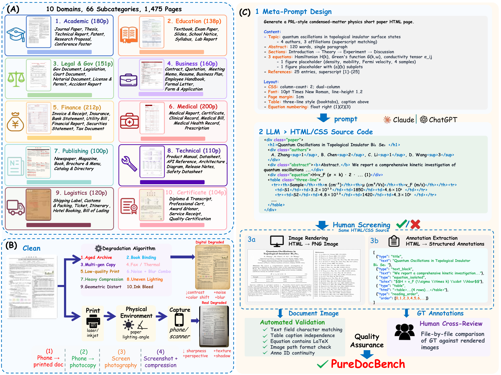
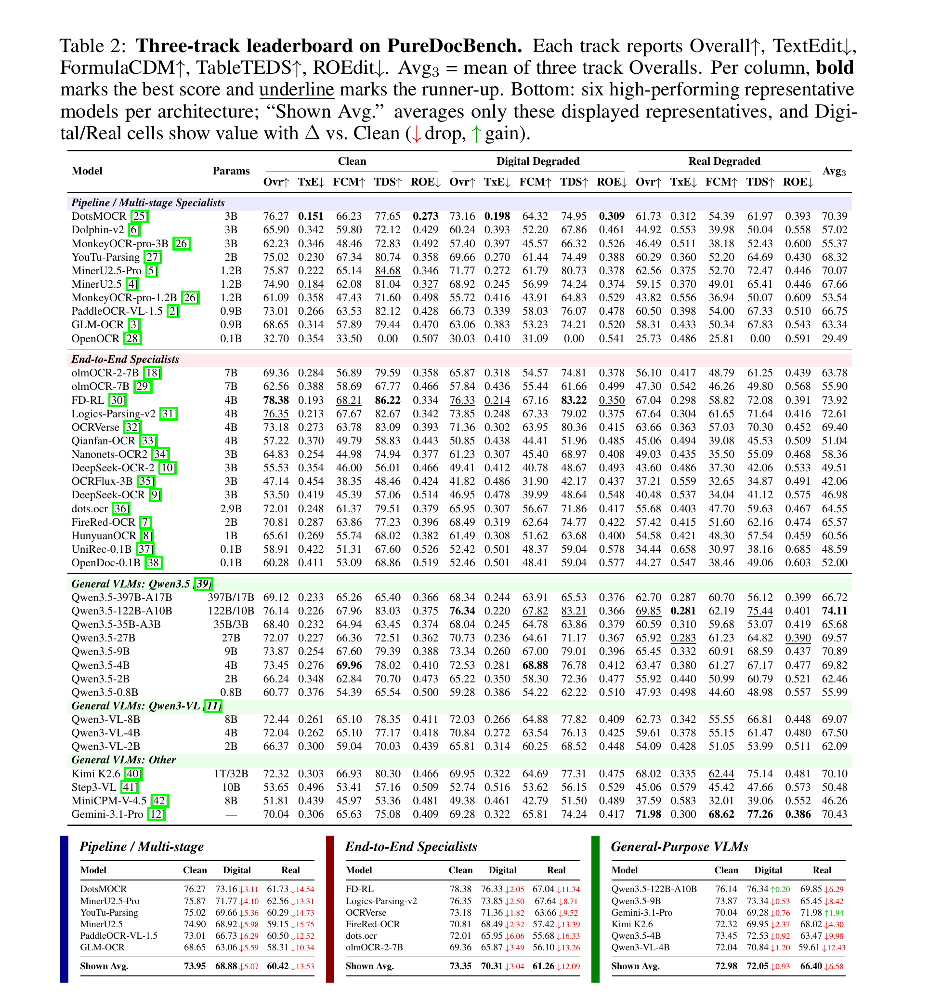
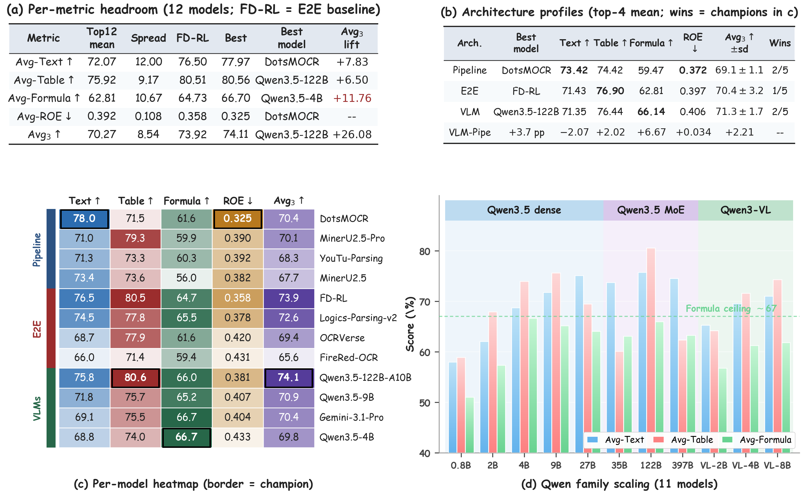
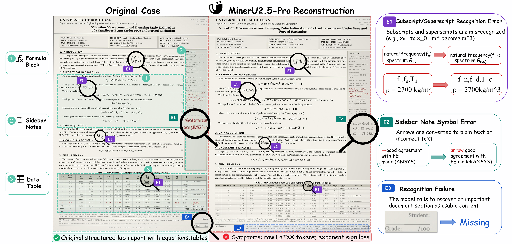
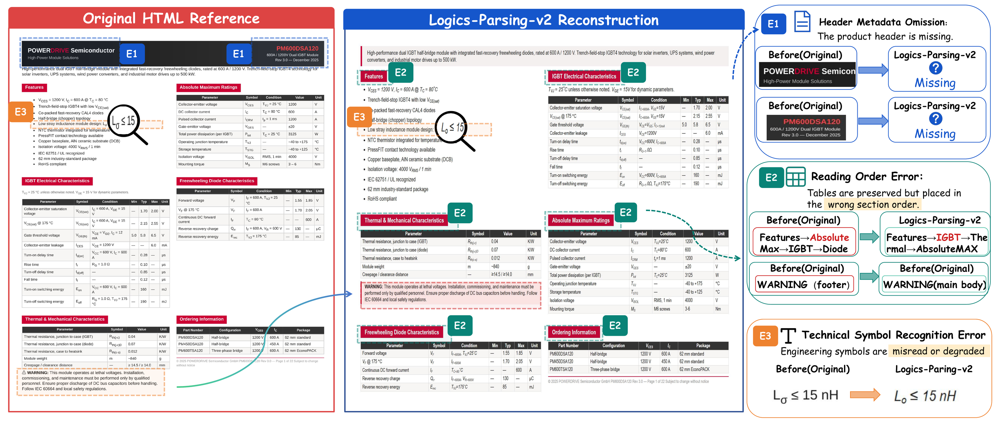
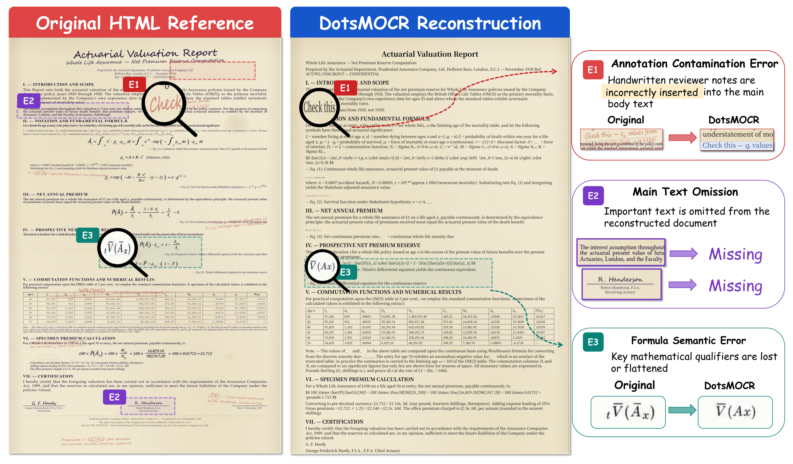
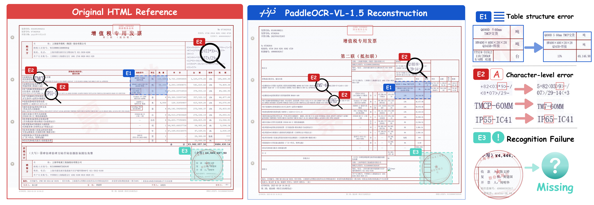
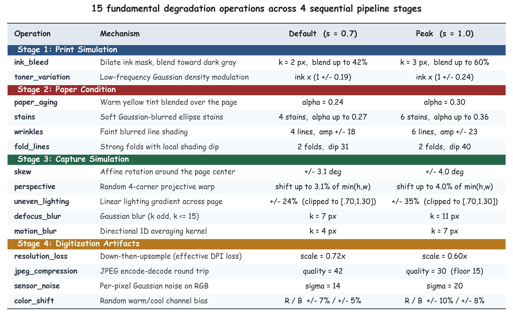
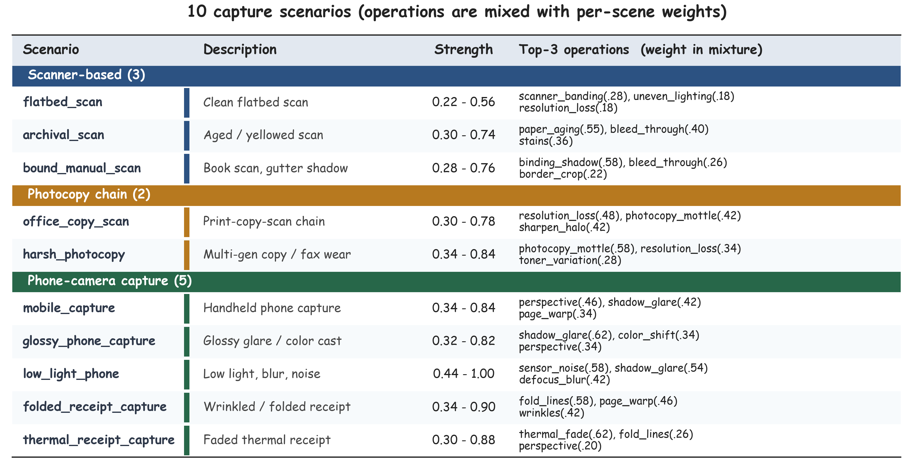
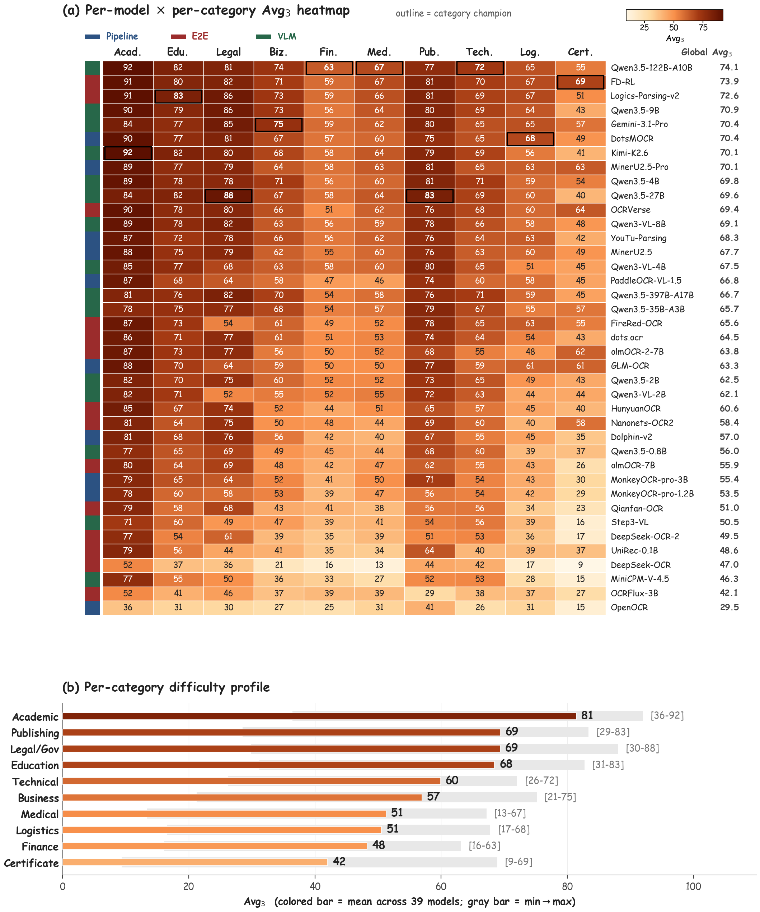

# PureDocBench 中文说明

<p align="center">
  <strong>文档解析离真正解决还有多远？</strong><br>
  PureDocBench 是一个面向 OCR 与文档解析的源可追踪 benchmark，覆盖 clean、digital-degraded、real-degraded 三条评测轨道。
</p>

<p align="center">
  <a href="https://huggingface.co/datasets/zhihengli-casia/puredocbench">Hugging Face Dataset</a> |
  <a href="../paper/PureDocBench-paper.pdf">Paper PDF</a> |
  <a href="ANNOTATION_CORRECTIONS.md">GT 标注 Review</a> |
  <a href="../README.md">English README</a>
</p>

PureDocBench 的文档图像由 HTML/CSS 源文件渲染生成，GT 标注从同一份结构化源中抽取。这样可以减少后验人工标注噪声，并让文本、公式、表格、阅读顺序等结构化元素都能被稳定评测。

## 更新

- **2026-06-14**：将公开 GT bbox 标注更新为 `puredocbench-gt-bbox-v1.0.0`，并开放 [GT 标注 Review](ANNOTATION_CORRECTIONS.md) 供社区检查和提交修正。下载后的数据结构仍然是三部分：`images/`、`html/`、`gt/`；这个版本名只表示 `gt/` 里的 bbox 标注版本。报告评测结果时请注明使用的 GT bbox 版本。
- **2026-05-08**：发布 PureDocBench 论文 PDF 和初始完整数据集，数据托管在 [Hugging Face](https://huggingface.co/datasets/zhihengli-casia/puredocbench)。

<p align="center">
  
</p>

## 数据概览

| 项目 | 数量 |
|---|---:|
| 官方页面 | 1,475 |
| 官方图像 | 4,425 |
| 文档大类 | 10 |
| 细粒度子类 | 66 |
| 图像轨道 | clean / digital-degraded / real-degraded |
| 评分结构 | 文本、公式、表格、阅读顺序 |

## 论文主表

论文主表评测了 40 个系统，包括 pipeline 专家模型、端到端文档解析模型和通用 VLM。每条轨道报告 Overall、TextEdit、FormulaCDM、TableTEDS 和 ROEdit；Avg3 是三条轨道 Overall 的平均。

<p align="center">
  
</p>

## 诊断结果

诊断图展示了当前模型的主要瓶颈：公式识别仍然是最大缺口，真实退化会比数字退化更明显地改变模型排序。

<p align="center">
  
</p>

## Case Studies

以下四个 case study 均来自论文原图，覆盖学术、商务、金融和证照场景。它们展示了聚合分数容易隐藏的问题，包括公式语义丢失、阅读顺序错误、批注污染、表格结构错误、字符级错误和印章区域遗漏。

### Case 1：学术文档

<p align="center">
  
</p>

### Case 2：商务表格

<p align="center">
  
</p>

### Case 3：金融精算报告

<p align="center">
  
</p>

### Case 4：中文产品质量证书

<p align="center">
  
</p>

## 附录精选图

附录中保留了退化设计、分领域表现和 source-validity 检查，用于说明 benchmark 的可控性与可复现性。

<p align="center">
  
</p>

<p align="center">
  
</p>

<p align="center">
  
</p>

<p align="center">
  
</p>

## 数据下载

完整数据托管在 Hugging Face：

```bash
shasum -a 256 -c SHA256SUMS.txt
cat pdb_full.tar.part-* | tar -xf -
```

也可以用仓库里的脚本校验分片和解压后的 release：

```bash
python scripts/verify_split_archive.py /path/to/downloaded/files

python scripts/validate_release_manifest.py \
  --release-root /path/to/puredocbench-v1.0 \
  --manifest manifests/release_manifest_candidate_1475.csv
```

## GT 标注 Review

当前 GT bbox 版本：`puredocbench-gt-bbox-v1.0.0`。可以使用 review app 检查标注并导出 correction patch。

- 公开 Review app：
  [Open GT Review App](https://zhihengli-casia.github.io/PureDocBench/review/gt_case_compare_all_fixed7/index.html?cb=puredocbench_gt_bbox_v1_0_0_local_images)
- 仓库文件：
  [`review/gt_case_compare_all_fixed7/index.html`](../review/gt_case_compare_all_fixed7/index.html)
- 修正说明：
  [docs/ANNOTATION_CORRECTIONS.md](ANNOTATION_CORRECTIONS.md)
- 提交修正：
  [New GT annotation correction issue](https://github.com/zhihengli-casia/PureDocBench/issues/new?template=annotation_error.yml)（表单支持中文或英文）

本地启动：

```bash
mkdir -p review/gt_case_compare_all_fixed7/assets
ln -s /path/to/puredocbench-v1.0/images/clean review/gt_case_compare_all_fixed7/assets/images
python3 -m http.server 8767 --directory review/gt_case_compare_all_fixed7
```

打开：

```text
http://127.0.0.1:8767/index.html?cb=puredocbench_gt_bbox_v1_0_0_local_images
```

静态 app URL：

```text
https://zhihengli-casia.github.io/PureDocBench/review/gt_case_compare_all_fixed7/index.html?cb=puredocbench_gt_bbox_v1_0_0_local_images
```

GitHub 仓库不包含完整图片。网页端视觉检查时，点击 `Load Images`，
选择下载后的 `images/clean` 文件夹；本地启动也可以使用上面的软链方式。

## GT 坐标补齐

如果需要空间标注，可以从 HTML/CSS 源重新渲染并补齐 clean 轨道坐标：

```bash
python scripts/add_gt_coordinates.py \
  --release-root /path/to/puredocbench-v1.0 \
  --manifest manifests/release_manifest_candidate_1475.csv \
  --in-place \
  --include-bbox \
  --include-coordinate-system \
  --report coordinate_report.json

python scripts/validate_release_manifest.py \
  --release-root /path/to/puredocbench-v1.0 \
  --manifest manifests/release_manifest_candidate_1475.csv \
  --require-coordinates \
  --require-bbox
```

脚本会按 OmniDocBench GT 约定为每个 `layout_dets` 元素写入矩形 `poly`。
`poly` 是 clean 图像像素坐标，顺序为左上、右上、右下、左下：
`[x1, y1, x2, y1, x2, y2, x1, y2]`。如需额外写入派生的
`bbox: [x1, y1, x2, y2]`，可以加 `--include-bbox`；正式坐标字段以
`poly` 为准。如果本机还没有 Playwright 浏览器，先运行
`playwright install chromium`；也可以加 `--browser-channel chrome` 使用本机
Chrome。

## 推理与评分接口

仓库提供统一 CLI，支持任意模型命令模板、轻量评分，以及导出到 OmniDocBench 官方 evaluator：

```bash
pip install -e .

puredocbench infer \
  --images /path/to/puredocbench-v1.0/images/clean \
  --output-dir predictions/my_model_clean \
  --command-template 'python my_model_infer.py --image {image} --out {output}'

puredocbench score \
  --release-root /path/to/puredocbench-v1.0 \
  --manifest manifests/release_manifest_candidate_1475.csv \
  --pred-dir predictions/my_model_clean \
  --track clean \
  --out-dir scores/my_model_clean
```

完整说明见 [docs/INFERENCE_SCORING.md](INFERENCE_SCORING.md)。

## 许可

- 数据集按 **CC BY 4.0** 发布，见 [LICENSE_DATA](../LICENSE_DATA)。
- 代码按仓库 [LICENSE](../LICENSE) 发布。
- 本仓库不重新分发模型权重。

## 引用

```bibtex
@misc{puredocbench,
  title        = {How Far Is Document Parsing from Solved? PureDocBench: A Source-Traceable Benchmark across Clean, Degraded, and Real-World Settings},
  author       = {Li, Zhiheng and collaborators},
  year         = {2026},
  howpublished = {\url{https://github.com/zhihengli-casia/puredocbench}},
  note         = {Dataset and benchmark release}
}
```
